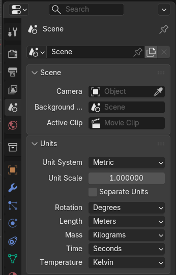
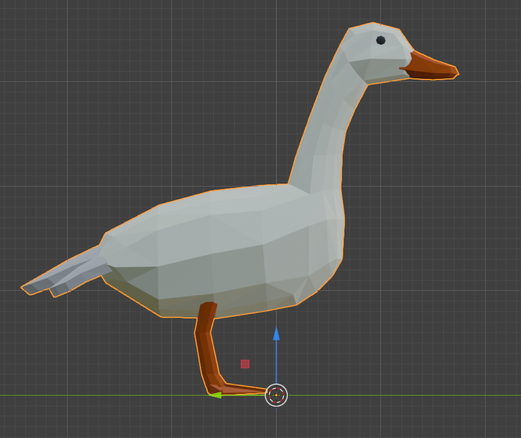
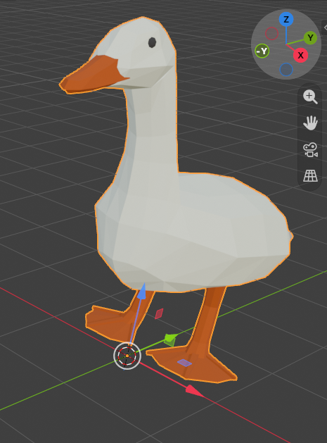
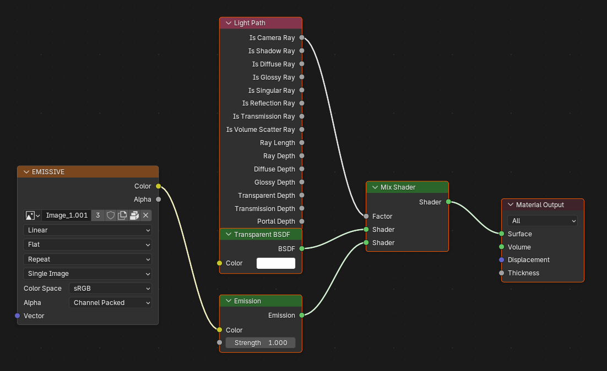

# Penyimpanan Aset Model 3D

> **Branch ini digunakan sebagai penyimpanan online sementara** untuk file model 3D (`.glb`) dan thumbnail yang akan digunakan dalam aplikasi Mobile AR Furniture.

## Tujuan Branch

Branch `items` berfungsi sebagai staging area untuk menyimpan aset 3D furnitur sebelum di-deploy atau di-referensikan oleh aplikasi utama. Aset yang tersimpan di sini dapat diakses melalui URL raw GitHub untuk kebutuhan pengembangan dan pengujian.

> **Catatan:** Branch ini bukan penyimpanan permanen. Untuk production, aset akan dimigrasikan ke layanan cloud storage yang lebih sesuai.

## Folder

| Folder       | Deskripsi                                                                                                                                                 |
| -------------- | ----------------------------------------------------------------------------------------------------------------------------------------------------------- |
| `model/`     | Menyimpan file model 3D dalam format GLB (GL Transmission Format Binary). Format ini dipilih karena ringan dan kompatibel dengan Unity serta platform AR. |
| `thumbnail/` | Menyimpan gambar preview model dalam format PNG yang digunakan untuk tampilan katalog di aplikasi.                                                        |

## Ketentuan Permodelan Objek di Blender

### 1. Skala & Satuan

- Gunakan satuan metrik di Blender (`Properties > Scene > Units > Metric`).

  
- 1 unit Blender = 1 meter di dunia nyata.
- Model dibuat sesuai dimensi nyata objek furnitur.

### 2. Origin Point

- Origin (titik pusat objek) diletakkan di bagian bawah tengah model (bottom center).

  

### 3. Orientasi Objek

- Sumbu -Y = arah depan (forward) objek.
- Sumbu Z = arah atas (up) objek.
- Pastikan bagian depan furnitur menghadap ke arah sumbu -Y.

  

### 4. Apply Transformations

- Sebelum export, selalu apply semua transformasi:
  - `Ctrl + A` → All Transforms (Location, Rotation, Scale).
- Ini memastikan skala dan rotasi objek ter-reset ke nilai default (1,1,1) dan (0,0,0).

### 5. Polygon Count

- [Masih dalam penyesuaian]

### 6. Material & Tekstur

- [Masih dalam penyesuaian]
- Struktur shading yang berhasil diterapkan untuk saat ini.

  

### 7. Export

- Format export: GLB (binary glTF).

**Geometry:**

- Apply Modifiers
- UVs
- Normals
- Materials: Export
- [Masih dalam penyesuaian]
